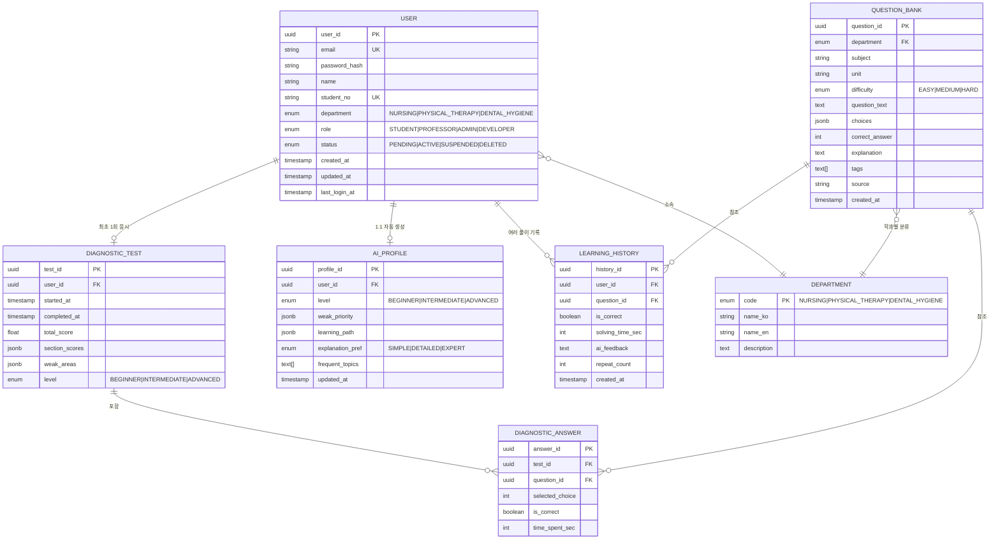

# ER 다이어그램 — CampusON

> Day 1 기준 초기 ER 다이어그램. Week 2에 KBDocument(벡터), AIRequestLog 등이 추가됩니다.

## 핵심 엔터티 관계도



## 엔터티 설명

### 1. USER

서비스의 모든 사용자(학생/교수/관리자/개발자)를 통합 관리. `role`로 구분하고 `department`로 학과별 스코프를 결정합니다.

**핵심 인덱스**

- `email` (unique)
- `student_no` (unique, 학생만 해당)
- `(department, role)` — 학과별 사용자 빠른 조회

### 2. DEPARTMENT

학과 enum 테이블. 현재는 3개 학과 고정:

- `NURSING` — 간호학과
- `PHYSICAL_THERAPY` — 물리치료학과
- `DENTAL_HYGIENE` — 치위생과

### 3. DIAGNOSTIC_TEST

학생의 최초 진단 테스트 결과. **사용자당 1회로 제한**되며 결과는 AI_PROFILE 자동 생성의 입력이 됩니다.

`section_scores` 예시:

```json
{
  "성인간호학": 0.72,
  "기본간호학": 0.55,
  "정신간호학": 0.81
}
```

`weak_areas` 예시:

```json
[
  {"unit": "약리학", "score": 0.42, "priority": 1},
  {"unit": "기본간호학", "score": 0.55, "priority": 2}
]
```

### 4. DIAGNOSTIC_ANSWER

진단 테스트의 문항별 응답. 채점 후 각 문항의 정오답 여부와 풀이 시간을 기록합니다.

### 5. QUESTION_BANK

국가고시 문제은행. `choices`는 JSON 배열 (예: `["선지1", "선지2", "선지3", "선지4"]`), `correct_answer`는 0-indexed 정답 번호.

### 6. LEARNING_HISTORY

학생의 모든 문제 풀이 이력. AI 추천 엔진과 오답노트의 데이터 소스가 됩니다.

### 7. AI_PROFILE

학생별 AI 튜터링 개인화 프로파일. 진단 테스트 직후 자동 생성되고 이후 학습 이력으로 점진적 업데이트됩니다.

## 권한 매트릭스 (Day 2 RBAC 구현 시 참고)

| 테이블 | Student | Professor | Admin | Developer |
| --- | :---: | :---: | :---: | :---: |
| 본인 USER | R/W | R | R | R |
| 학과 USER | - | R | R/W | R/W |
| 본인 DIAGNOSTIC_TEST | R | R(학과) | R | R |
| 본인 LEARNING_HISTORY | R | R(학과) | R | R |
| QUESTION_BANK | R | R | R/W | R/W |
| AI_PROFILE | R | R(학과) | R | R/W |

## Week 2에 추가될 엔터티 (Day 8~)

- **KB_DOCUMENT** — RAG용 지식베이스 문서 (vector embedding 컬럼 포함)
- **AI_REQUEST_LOG** — AI 호출 감사 로그
- **RECOMMENDATION** — 추천 엔진 결과 캐시
